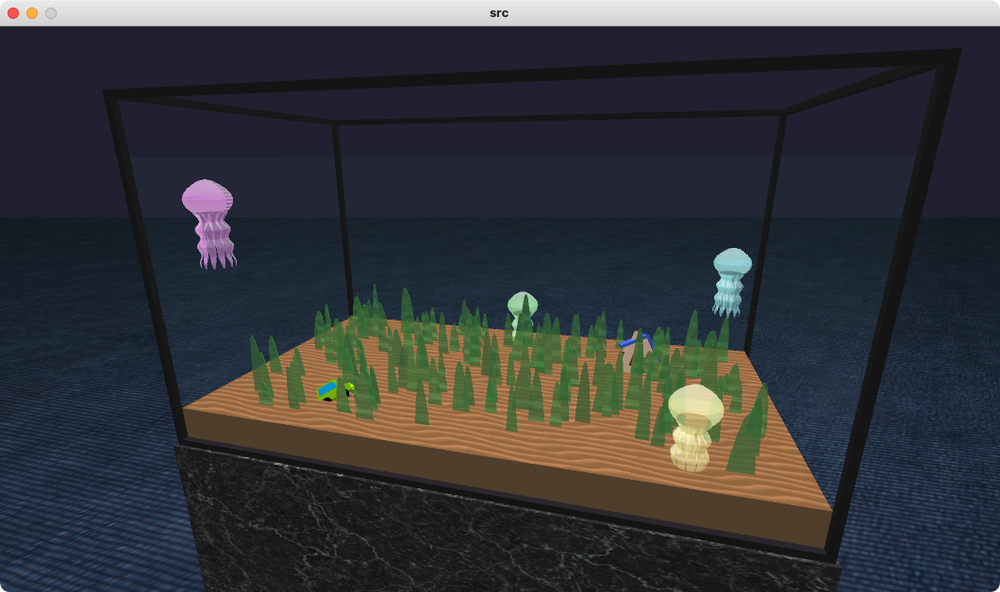

# Jellyfish Aquarium

This is a work I created for a Visual Computing assignment.

## Download

Select zip for your operating system.

[https://github.com/TrpFrog/jellyfish-aquarium/releases/](https://github.com/TrpFrog/jellyfish-aquarium/releases/)

## How to operate

- **Drag** to change the camera's field of view.
- **Press WASD** to change the camera's position.
- **Turn your mouse wheel** to zoom in/out.
- **Center click** to reset the camera.
- **Right click** to feed jellyfish.
- **Press J/K** to change the speed of jellyfish.
